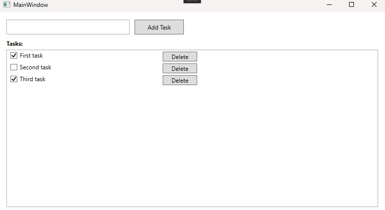
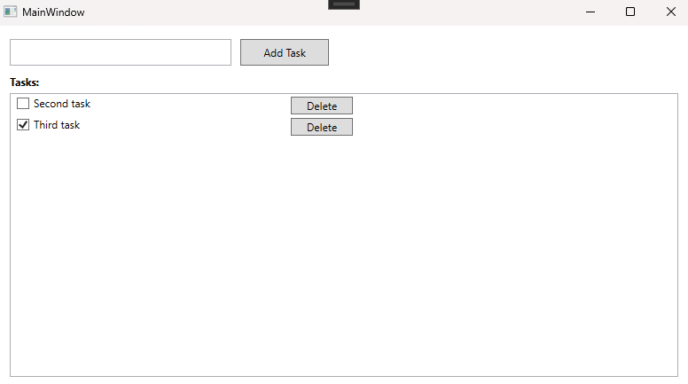

# Task Manager App

A simple desktop task manager built with C# (WPF) and SQLite, allowing users to create, complete, and delete tasks with persistent storage.

## Features

- Add new tasks with a title
- Mark tasks as completed using checkboxes
- Delete tasks
- Data is saved locally in a SQLite database, so tasks persist between sessions

## Tech Stack

- **C#** / **.NET 8**
- **WPF** (Windows Presentation Foundation) for the UI
- **SQLite** (via `Microsoft.Data.Sqlite`) for local data storage

## How It Works

- `Models/TaskItem.cs` — defines the data structure for a single task
- `Data/DatabaseHelper.cs` — handles all database operations (create table, insert, read, update, delete)
- `MainWindow.xaml` / `MainWindow.xaml.cs` — the UI and its logic, using data binding to display tasks

## Screenshot

## How to Run

1. Clone the repository
2. Open `TaskManagerApp.sln` in Visual Studio
3. Restore NuGet packages (should happen automatically)
4. Press F5 to build and run

## Possible Future Improvements

- Edit existing task titles
- Task categories/priorities
- Due dates and reminders